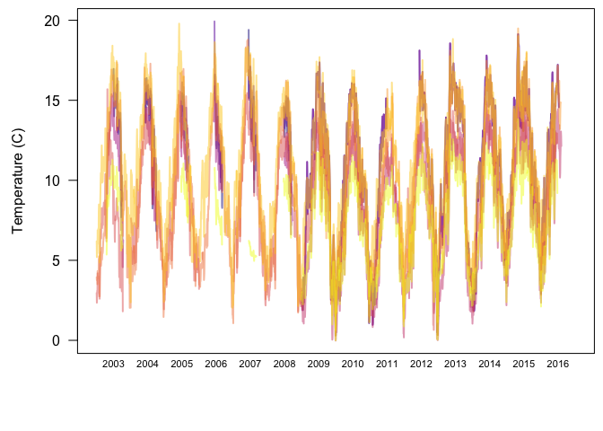
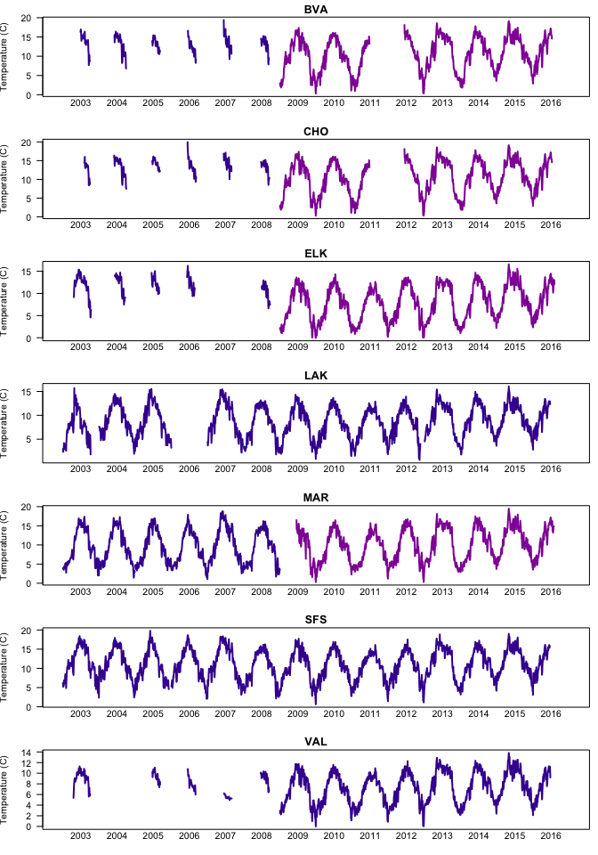

<br/>

[__Mark Scheuerell__](https://faculty.washington.edu/scheuerl/)  
_Fish Ecology Division, Northwest Fisheries Science Center, National Marine Fisheries Service, National Oceanic and Atmospheric Administration, Seattle, WA, USA_

__Karl Veggerby__  
_Ocean Associates, Seattle, WA, USA_

***

This is version 0.19.04.25.

***

# Background

We would like to examine temperature as a possible covariate in the analyses of the growth data. However, the temperature are not complete for all sites and times, and therefore we have to impute some of the values. To do so, we will use the __MARSS__ package, which is designed to fit autoregressive models to multivariate time series data.

Specifically, for temperature measured at site $i$ in year $y$ and day $d$, $\mathbf{T}_{i,y,d}$, we can write

\begin{equation} \label{eq4}
  \begin{gathered}
    \mathbf{T}_{i,y,d} = \mathbf{x}_{i,y,d} + \mathbf{a}_{i,y} + \mathbf{v}_{i,y,d} \\
    \mathbf{x}_{i,y,d} = \mathbf{x}_{i,y,d-1} + \mathbf{w}_{i,y,d}
  \end{gathered}
\end{equation}

# Requirements


```r
## for analysis
library(MARSS)
## for plotting
library(viridisLite)
## for dir mgmt
library(here)
datadir <- here("data")
```

# Data munging

We begin by loading the data file with the temperature summaries by time (rows) and location (cols).


```r
## load obs covariates
cobs <- read.csv(file.path(datadir, "daily_mean_temp.csv"),
                 stringsAsFactors = FALSE)
## inspect data
head(cobs)
```

```
##   year doy data_source_BVA data_source_CHO data_source_ELK data_source_MAR
## 1 2003 122    team carcass    team carcass    team carcass    achord_gordy
## 2 2003 123    team carcass    team carcass    team carcass    achord_gordy
## 3 2003 124    team carcass    team carcass    team carcass    achord_gordy
## 4 2003 125    team carcass    team carcass    team carcass    achord_gordy
## 5 2003 126    team carcass    team carcass    team carcass    achord_gordy
## 6 2003 127    team carcass    team carcass    team carcass    achord_gordy
##   data_source_LAK data_source_SFS data_source_VAL daily_mean_BVA
## 1    team carcass    achord_gordy    achord_gordy             NA
## 2    team carcass    achord_gordy    achord_gordy             NA
## 3    team carcass    achord_gordy    achord_gordy             NA
## 4    team carcass    achord_gordy    achord_gordy             NA
## 5    team carcass    achord_gordy    achord_gordy             NA
## 6    team carcass    achord_gordy    achord_gordy             NA
##   daily_mean_ELK daily_mean_LAK daily_mean_MAR daily_mean_SFS
## 1             NA             NA       2.964167       3.943333
## 2             NA             NA       2.349583       3.751667
## 3             NA             NA       2.561667       3.743333
## 4             NA             NA       3.106250       3.901250
## 5             NA             NA       3.071667       3.506250
## 6             NA             NA       4.188333       4.332083
##   daily_mean_VAL daily_mean_CHO
## 1       6.193333             NA
## 2       5.201250             NA
## 3       5.589583             NA
## 4       6.169583             NA
## 5       5.454583             NA
## 6       6.882500             NA
```

Let's simplify some names in the file and round the observations to the nearest 0.01.


```r
## simplify colnames
colnames(cobs) <- gsub("data_source", replacement = "s", x = colnames(cobs))
colnames(cobs) <- gsub("daily_mean", replacement = "T", x = colnames(cobs))
## site abbrevs
sites <- sort(gsub("T_", replacement = "", x = colnames(cobs)[10:16]))
## simplify sources
cobs[cobs=="team carcass"] <- "car"
cobs[cobs=="achord_gordy"] <- "tag"
## round temps
cobs[,grep("T_", colnames(cobs))] <- round(cobs[,grep("T_", colnames(cobs))], 2)
```

The temperature data come from two different sources:

  1. the food web group (Sanderson et al.), and  
  2. the juvenile tagging group (Achord, Axel et al.).  
  
We need to split the data out by those groups.


```r
## empty data frames
car <- tag <- matrix(NA, nrow(cobs), length(sites),
                     dimnames = list(NULL, sites))
## measurements
vals <- cobs[,-(1:9)]
## indices of data type
i_car <- cobs[,3:9] == "car"
i_tag <- cobs[,3:9] == "tag"
## group-specific data
car[i_car] <- vals[i_car]
tag[i_tag] <- vals[i_tag]
## drop any sites with all NA's
car <- car[,apply(car, 2, function(x) !all(is.na(x)))]
colnames(car) <- paste0(colnames(car), "_car")
tag <- tag[,apply(tag, 2, function(x) !all(is.na(x)))]
colnames(tag) <- paste0(colnames(tag), "_tag")
## regroup by sites & source
cobs_m <- cbind(car, tag)
cobs_m <- cobs_m[,sort(colnames(cobs_m))]
```

# Plot the data

## All sites together


```r
par(mai=c(0.9,0.9,0.1,0.1), omi=c(0,0,0,0))
## plot the data
matplot(cobs_m, type = "l", lty = "solid",
        lwd = 2, las = 1,
        ylab = "Temperature (C)", xaxt="n",
        col = plasma(ncol(cobs_m), alpha = 0.5, begin = 0, end = 1))
years <- unique(cobs$year)
n_yrs <- length(years)
n_days <- nrow(cobs) / n_yrs
axis(side = 1,
     at = seq(n_days / 2, by = n_days, length.out = n_yrs),
     labels = years,
     tick = FALSE, line = -1,
     cex.axis = 0.7)
```

<!-- -->

## By site


```r
par(mfrow = c(length(sites), 1),
    mai = c(0.3,0.5,0.2,0.1),
    omi = c(0,0,0,0))
for(i in sites) {
  ## site-specific data
  tmp <- cobs_m[, grep(i, colnames(cobs_m)), drop = FALSE]
  ## plot the data
  matplot(tmp, type = "l", lty = "solid",
          lwd = 2, las = 1,
          ylab = "Temperature (C)", xaxt="n", main = i,
          col = plasma(ncol(tmp), alpha = 1, begin = 0.1, end = 0.3))
  axis(side = 1,
       at = seq(n_days / 2, by = n_days, length.out = n_yrs),
       labels = years,
       tick = FALSE, line = -1)
}
```

<!-- -->


